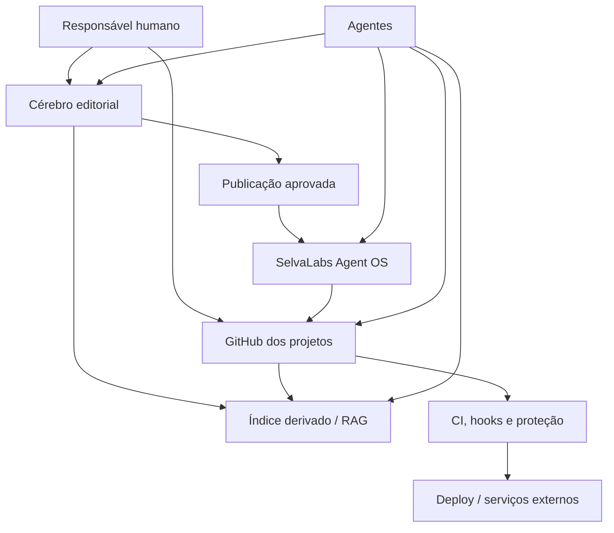

# SPEC — Arquitetura do Sistema Operacional de Agentes SelvaLabs

- **Versão:** 0.1.0
- **Estado:** piloto
- **Escopo:** ecossistema com múltiplos repositórios
- **Princípio de migração:** aditivo e não destrutivo

## 1. Problema

Repositórios operados por agentes acumulam instruções no `README.md`, prompts dispersos, memórias não verificadas e procedimentos repetidos. Isso gera contexto excessivo, duplicação, divergência entre projetos e risco operacional.

## 2. Objetivo

Criar uma arquitetura em que qualquer agente consiga:

- localizar as regras do repositório;
- recuperar contexto sem carregar toda a biblioteca;
- reutilizar skills e playbooks;
- distinguir orientação de enforcement;
- produzir handoffs auditáveis;
- operar serviços externos com menor privilégio;
- separar conhecimento editorial de operação de software;
- registrar memória durável sem expor workspaces privados.

## 3. Planos da arquitetura

### 3.1 Plano editorial

**Sistema recomendado:** um Cérebro no Notion ou ferramenta equivalente.

Responsável por estudos, pesquisas, decisões transversais, curadoria, catálogo, memória durável e aprovação editorial.

### 3.2 Plano operacional

**Sistema:** repositório GitHub de cada projeto.

Responsável por arquitetura, comandos, testes, deploy, segurança, decisões locais e estado necessário para trabalhar naquele código.

### 3.3 Plano de capacidades

**Sistema:** `selvalabs-agent-os`.

Responsável por políticas, skills, templates, adaptadores e validações reutilizáveis.

### 3.4 Plano de consulta

**Sistema:** índice, banco derivado ou RAG.

Responsável por busca, filtros, embeddings, permissões de consulta e rastreabilidade. Não é a origem editorial nem operacional.

### 3.5 Plano de enforcement

**Sistema:** CI, hooks, sandbox, proteção de branch, permissões e revisão humana.

Responsável por regras que não podem depender apenas da interpretação do modelo.

## 4. Arquitetura lógica

## 5. Hierarquia de contexto

Da camada mais ampla para a mais específica:

1. política organizacional;
2. preferências do operador;
3. política compartilhada do Agent OS;
4. `START-HERE.md` e `AGENTS.md` do repositório;
5. instrução do diretório ou componente;
6. skill selecionada;
7. handoff da tarefa;
8. pedido atual do humano.

Regras mais específicas não podem enfraquecer segurança organizacional. Conflitos devem ser registrados, não resolvidos silenciosamente.

## 6. Artefatos

### `START-HERE.md`

Porta de entrada curta que explica propósito, ordem mínima de leitura, links canônicos e próxima ação.

### `AGENTS.md`

Roteador curto com comandos essenciais, convenções e regras persistentes.

### `docs/agent/MEMORY.md`

Fatos estáveis e revisados do projeto. Não recebe segredos, opiniões temporárias, logs de conversa ou pendências de sessão.

### `docs/agent/HANDOFF.md`

Estado temporário da frente atual: realizado, evidências, pendências, riscos e próxima ação.

### Biblioteca de Markdowns

Memória durável e curada criada pelo usuário no Cérebro editorial. Guarda processos, decisões, integrações, incidentes resolvidos e aprendizados reutilizáveis.

### Skill

Diretório reutilizável com `SKILL.md` e, quando necessário, `scripts/`, `references/` e `assets/`.

### Política

Regra compartilhada que define limites e responsabilidades.

### Runbook

Procedimento operacional detalhado. Quando crítico, possui enforcement correspondente.

### ADR

Decisão arquitetural versionada, com contexto, alternativas e consequências.

## 7. Fontes canônicas

Cada artefato possui uma fonte canônica. Sincronização bidirecional sem proprietário definido é proibida.

| Artefato | Origem recomendada |
|---|---|
| Estudo ou pesquisa | Cérebro editorial |
| Memória durável | Biblioteca de Markdowns do usuário |
| Arquitetura de um projeto | GitHub do projeto |
| Skill compartilhada | Agent OS |
| Workflow compartilhado | Agent OS |
| Handoff de código | GitHub do projeto |
| Índice semântico | Camada derivada |
| Segredos | Gerenciador de segredos |

## 8. Publicação e sincronização

Fluxo editorial recomendado:

1. criação ou revisão humana no Cérebro;
2. aprovação explícita;
3. normalização para Markdown canônico;
4. issue e branch no repositório de destino;
5. validação automática;
6. pull request e revisão;
7. merge;
8. atualização de versão, origem e hash no registro editorial;
9. atualização opcional do índice derivado.

Conteúdo operacional nasce no GitHub e pode ser referenciado ou indexado no Cérebro, mas não deve ser reescrito automaticamente por ele.

## 9. Segurança e privacidade

- leitura é o modo inicial para serviços externos;
- escrita exige intenção explícita e escopo delimitado;
- produção exige preflight, aprovação e rollback;
- segredos ficam fora do Markdown;
- mudanças destrutivas exigem confirmação humana específica;
- agentes não ocultam falhas nem corrigem evidências silenciosamente;
- regras críticas recebem enforcement técnico;
- documentação pública usa exemplos fictícios;
- nenhuma estrutura privada de workspace é copiada para este repositório.

Consulte `docs/governance/PUBLIC-SANITIZATION.md`.

## 10. Adoção

### Piloto A — domínio de conhecimento

Validar catálogo, fontes, revisão editorial, Biblioteca de Markdowns e navegação seletiva.

### Piloto B — projeto de software controlado

Validar bootstrap, contexto local, segurança, handoff, PR e CI.

### Piloto C — operação autorizada

Validar deploy, rollback e integrações externas somente depois dos dois primeiros pilotos.

### Expansão

Somente após os pilotos:

- registrar padrões recorrentes como skills;
- criar workflows reutilizáveis;
- adicionar indexação;
- adotar RAG quando houver volume que justifique;
- ampliar permissões de escrita gradualmente.

## 11. Critérios de aceite da versão 0.1

- `START-HERE.md` e `AGENTS.md` pequenos e funcionais em dois repositórios;
- nenhuma duplicação manual extensa entre arquivos específicos de ferramentas;
- skills iniciais válidas;
- deploy documentado com rollback no piloto operacional;
- handoff reproduzível por outro agente;
- Biblioteca de Markdowns documentada como modelo genérico;
- nenhuma credencial ou contexto pessoal no repositório;
- validação automática executando em CI.

## 12. Não objetivos iniciais

- substituir a ferramenta editorial escolhida pelo usuário;
- criar uma plataforma própria antes dos pilotos;
- centralizar todos os detalhes de todos os projetos;
- automatizar escrita em produção sem revisão;
- migrar ou reorganizar páginas existentes de forma destrutiva;
- publicar conteúdo de um workspace real como exemplo.
